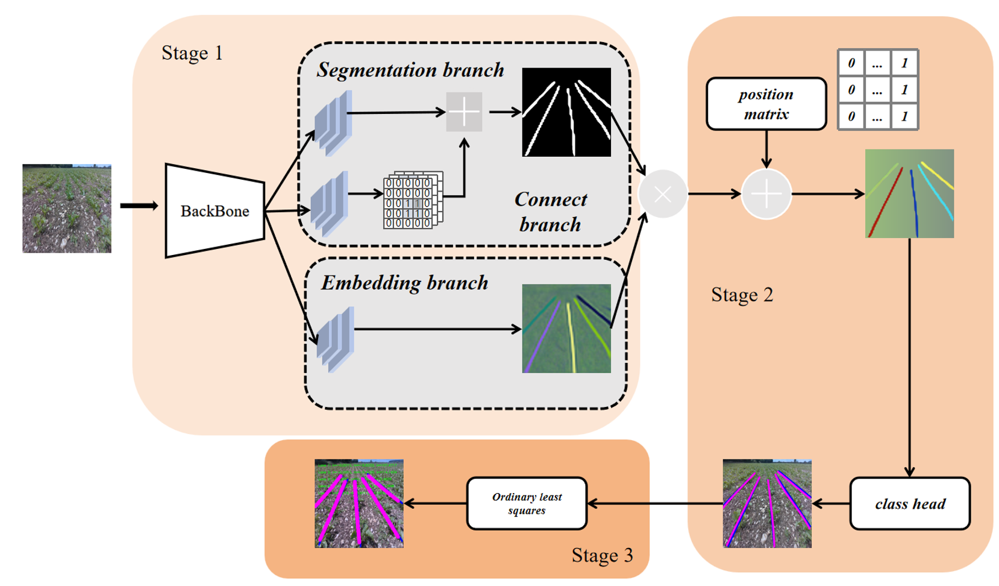

## 苗带检测

### 任务整体框架



* 采用基于实例分割的方法，保证标注任务较简单的情况下，抛弃传统语义分割所引入的聚类算法（如DBSCAN），大大降低分割帧率，在单张2080上推理速度大于100FPS
* 实验对比了三种在速度和准确度取得较好平衡的骨干网络，Bisenet V2，Pidnet-S，STDCnet，最终发现STDCnet具有较好表现。
* 为了更好的评价苗带质量，提出基于苗带像素准确率指标，与基于苗带条数的指标
* 针对任务整体框架中苗带背景分割部分，加入联通分支，使得苗带像素更加连续，去除破碎的苗带块。

## 不同主干网络对比结果

测试条件为：一张2080Ti 图片大小为256*256 

| 主干模型   | FPS      | $ACC_{pixel}$ | $ACC_{crop}$ | TH       |
| ---------- | -------- | ------------- | ------------ | -------- |
| Bisenet V2 | 72.1     | 94.6%         | 75.5%        | 0.35     |
| Bisenet V2 | 68.8     | 94.2%         | 82.4%        | 0.25     |
| Bisenet V2 | **70.7** | **93.2%**     | **85.1%**    | **0.15** |
| Bisenet V2 | 70.6     | 92.6%         | 87.0%        | 0        |
| Pidnet-S   | 82.4     | 90.9%         | 73.9%        | 0.35     |
| Pidnet-S   | 82.1     | 92.5%         | 86.3%        | 0.25     |
| Pidnet-S   | **75.6** | **91.6%**     | **89.5%**    | **0.15** |
| Pidnet-S   | 75.0     | 90.5%         | 90.1%        | 0        |
| STDCnet    | 122      | 95.28%        | 85.95%       | 0.35     |
| STDCnet    | **118**  | **94.18%**    | **89.6%**    | **0.25** |
| STDCnet    | 122      | 93.8%         | 91.0%        | 0.15     |
| STDCnet    | 119      | 93.5%         | 91.8%        | 0        |

### 主要评价指标介绍

对于每张给定的输入图片，我们假设模型输出有$c_1$条苗带，标注存在$c_2$条苗带，首先给出基于像素的准确率指标：

$$
ACC_{pixel} = \frac{1}{c_1}\ \sum_{i=1}^{c_1}\max\sum_{j=1}^{c_2}match(c_{1i}-c_{2j})
$$

*match*函数被定义为两条苗带的匹配程度计算公式如下,假设存在两条苗带$l_1,l_2$,$l_1,l_2$分别表示一系列苗带点：

$$
min_{height} = \max(\min(l_1[0],\min(l_2[0]))
$$

$$
max_{height} = \min(\max(l_1[0],\max(l_2[0]))
$$

$$
f(i)=\begin{cases}
1 & \ |l_{1}[1][i] - l_{2}[1][i]| < Threshold \\
0 & \ |l_{1}[1][i] - l_{2}[1][i]| >= Threshold \\ 
\end{cases}
$$

$$
Pixel_{correct} = \sum_{i = min_{height}}^{max_{height}}f(i)
$$

$$
Pixel_{all} = len(l_1[1])
$$

$$
match(l_{1}-l_{2}) = \dfrac{Pixel_{correct}}{Pixel_{all}}
$$

基于像素的准确率，只考虑了识别出来的苗带与标注苗带的匹配程度，没有关注苗带数目是否与标注的一致，因此增加一个基于苗带数目的准确率，这样可以更加细致的评价模型的优劣。(我们默认匹配度大于50%的为正确识别苗带)

$$
g(i)=\begin{cases}
1 & \ \max\sum_{j=1}^{c_2}match(c_{1i}-c_{2j}) > 0.5 \\
0 & \max\sum_{j=1}^{c_2}match(c_{1i}-c_{2j}) <= 0.5 \\ 
\end{cases}
$$

$$
n_1 = \sum_{i=1}^{c_1}g(i)
$$

$$
ACC_{crop} = \dfrac{n_1}{c_2}
$$


### 版本

python 3.8.19   
torch 1.12.1  
torchvision 0.13.1   
cuda 11.7.0  

### 环境配置

conda create -n env_name python==3.8  
conda install pytorch==1.12.1 torchvision==0.13.1 torchaudio==0.12.1 cudatoolkit=11.3 -c pytorch  
pip install requirements.txt  
其他少了那个安装那个  

### 数据集权重准备

#### 数据集下载

* 自建数据集

  ......

* 公用数据集（CRDLD）
  链接：https://pan.baidu.com/s/1kjEddZVdblg4Gt96eZJLiw?pwd=v3by 
  提取码：v3by 

  下面文件结构中，加粗部分是必须要有的。

  ```bash
  python ./CRDLD/generate_border.py   ##生成border_image（pidnet需要） instance_image（实际没有使用）
  python ./CRDLD/create_connection.py ##生成connect_8_d1 connect_8_d3连通性标注文件夹
  python ./CRDLD/generate_txt.py ##生成test.txt和train.txt
  ```

  .

  ├── **binary_image**

  ├── connect_8_d1

  ├── connect_8_d3

  ├── **create_connection.py**

  ├── **generate_border.py**

  ├── **generate_txt.py**

  ├── instance_image

  ├── **label_image**

  ├── **raw_image**

  ├── test.txt

  └── train.txt

#### 权重文件下载（weight_256）

链接：https://pan.baidu.com/s/1t-wlkSYnt-GsFUYade1KcQ?pwd=5lhx 
提取码：5lhx 
里面包含了三个模型的best和last轮权重文件

### 训练

```bash
## first stage
python Endtoend_train.py --model stdcnet/pidnet/bisenet --stage 1
##首先保存一阶段权重文件到weigt文件夹
## second stage
python Endtoend_train.py --model stdcnet/pidnet/bisenet --stage 2
##最后保存最终权重到weight_256文件夹
```

### 测试

详细修改参见代码，图片帧率的输出从第二张图片开始，**帧率计算时间为模型输出到苗带参数拟合的时间。**

```bash
python Endtoend_evalue.py --model stdcnet/pidnet/bisenet
```

